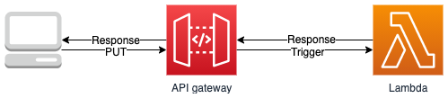

# Sample code for assignment

## Introduction

According to assignment requirement, the basic function of the API is to add *©* mark to a specific list of words. I used the following architecture to achieve this function.



The whole architecture is based on serverless services on AWS.

## Deployment

### Prerequisites

This architecture is deployed via Serverless Framework which is a popular tool for deploying serverless architecture on cloud. In order to use this tool to deploy the infrastructure, please make sure your environment has the following application installed:

- [AWS CLI](https://docs.aws.amazon.com/cli/latest/userguide/welcome-versions.html#welcome-versions-v2)
- [nodejs](https://nodejs.org/en/download/)
- [Serverless Framework](https://www.serverless.com/framework/docs/getting-started)

Since this architecture is based on AWS, user needs to make sure an AWS account is available for use and enough access rights are attached to the aws profile for the serverless tool to utilize.

### Deploy the backend API

Once at the project root path, simply execute the following code to deploy:

```bash
sls deploy
```

Please be aware that the tool `sls` is utilizing aws profile to access the corresponding aws platform resource. In this sample code, it is using the default profile. If it is intended to be deployed with profiles other than default, then please modify the **serverless.yml** file to adapt to it. Inside this **serverless.yml** file, there is one attribute called *provider.profile* and this attribute is used by the program to indicate which profile name to use. In addition, there is another attribute called *provider.region* which indicates the region for deploying the resource. Please also adapt this to your own convenience as well.

### Test with the sample UI

Once finished API deployment, please take notes on the output url for the API endpoint. Check the *.env* file under *sample-ui/* path and replace the value of **VUE_APP_URL** to the output url you just noted. Then execute the following command at the root of *sample-ui/* path.

```bash
npm install
npm run serve
```

After the test server is up and running, you can test the functionality of the backend API with a simple UI.

